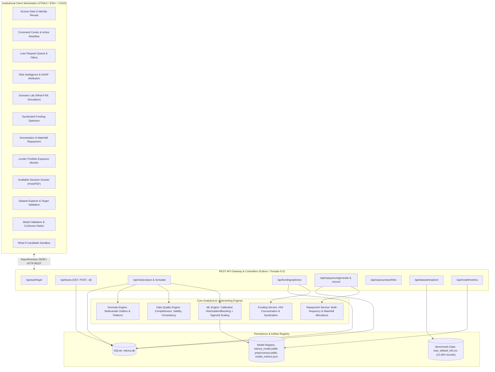
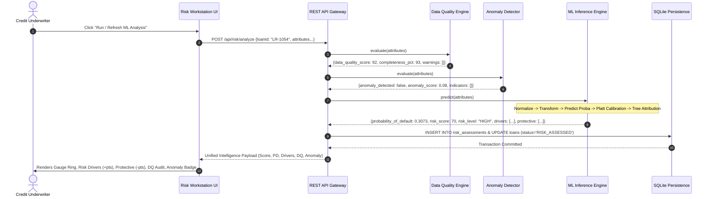
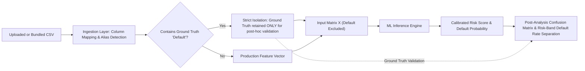
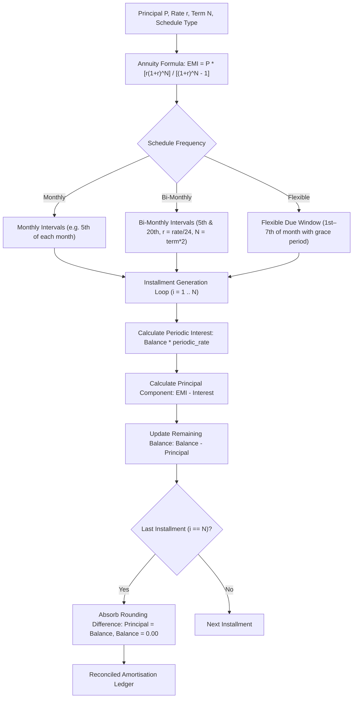
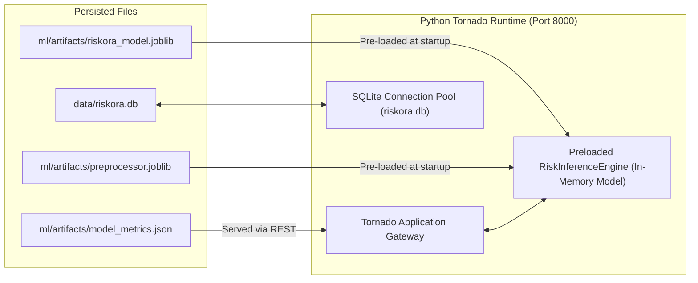
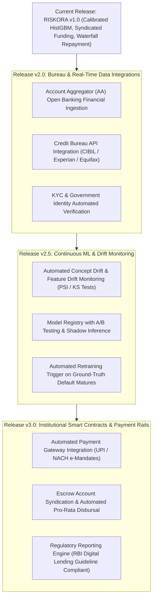

# RISKORA — System Architecture Specification
**AI-Assisted Risk-Based Framework for a Digital Micro-Lending Platform**

---

## 1. Overall System Architecture

The RISKORA platform is structured as an institutional three-tier financial workstation comprising an asynchronous REST API Gateway, modular core computational services, an embedded relational data layer, and an explainable machine learning inference engine.



---

## 2. Machine Learning Training & Evaluation Pipeline

The ML pipeline operates under strict data-leakage controls: the target variable `Default` is strictly isolated, and transformers are fitted exclusively on the stratified training split.

```mermaid
flowchart TD
    D1["Raw Benchmark Dataset (12,000 Records, 18 Columns)"] --> D2["Target Isolation: y = Default (0 / 1)"]
    D2 --> D3["Feature Matrix X (17 Raw Attributes)"]
    D3 --> D4["Feature Engineering: LoanToIncome, MonthlyBurdenRatio"]
    D4 --> D5["Stratified Split (70% Train: 8,400 | 15% Val: 1,800 | 15% Test: 1,800)"]
    
    subgraph Preprocessing["Preprocessing Pipeline (Fit on Train Only)"]
        P_Num["Numeric Transformer: StandardScaler (11 Features)"]
        P_Cat["Categorical Transformer: OneHotEncoder (7 Features)"]
    end
    D5 --> Preprocessing
    
    subgraph Benchmarking["Candidate Model Benchmarking (Validation Set)"]
        M1["Logistic Regression (L2 Regularized)"]
        M2["Random Forest (120 Trees, Balanced Weights)"]
        M3["HistGradientBoosting (Champion: AUC 0.799, Brier 0.081)"]
    end
    Preprocessing --> Benchmarking

    Benchmarking --> M_Select["Champion Selection: HistGradientBoosting"]
    M_Select --> M_Calib["Probability Calibration: CalibratedClassifierCV (Sigmoid / Platt, 5-Fold CV)"]
    M_Calib --> M_Eval["Unseen Test Set Evaluation (1,800 Records)"]
    
    subgraph EvaluationMetrics["Test Performance Verification"]
        E1["ROC-AUC: 0.7919"]
        E2["PR-AUC: 0.4023"]
        E3["Brier Score: 0.0821"]
        E4["Confusion Matrix @ 0.20 Threshold (TN: 1460, FP: 141, FN: 119, TP: 80)"]
        E5["Risk Band Monotonicity: Low (3.75%), Med (13.41%), High (36.20%)"]
    end
    M_Eval --> EvaluationMetrics
    EvaluationMetrics --> Export["Export Artifacts: riskora_model.joblib, preprocessor.joblib, model_metrics.json"]
```



---

## 3. Risk Assessment Execution Sequence



---

## 4. Dataset Ingestion & Target Isolation Flow



---

## 5. Funding Structure & Syndication Architecture

```mermaid
flowchart TD
    subgraph Input["Underwriting Trigger"]
        LoanReq["Active Loan Request (Principal P, Risk Level R)"]
    end

    subgraph DecisionNode{"Syndication Logic"}
        LoanReq --> Mode{"Mode Selection"}
        Mode -->|Single Lender| Single["100% Capital Committed by Sole Lender"]
        Mode -->|Fractional Syndication| Fract["Syndication Across K Lenders (K in 2..6)"]
    end

    subgraph ConcentrationAnalytics["Lender Concentration & HHI Engine"]
        Single --> HHI_High["HHI = 10,000 (Maximum Counterparty Concentration)"]
        Fract --> HHI_Calc["Calculate HHI = Sum(s_i^2)"]
        HHI_Calc --> HHI_Grade{"HHI Evaluation"}
        HHI_Grade -->|< 2,500| Dist["Well-Distributed Syndication"]
        HHI_Grade -->|2,500 - 5,000| Mod["Moderate Concentration"]
        HHI_Grade -->|> 5,000| High["High Lead Concentration"]
    end

    subgraph CapitalAllocation["Exact Capital Commitment"]
        Fract --> Shares["Share Allocation: Lead ~40%, Participant B ~35%, Participant C ~25%"]
        Shares --> ExactPennies["Exact Paise Reconciliation: Sum(Amounts) == Loan Principal"]
    end
```

---

## 6. Repayment Engine Flow & Schedule Generation



---

## 7. Repayment Waterfall Allocation Architecture

```mermaid
flowchart TD
    PaymentEvent["Repayment Received: Installment Payment = Principal + Interest"] --> PolicySelector{"Allocation Policy"}
    
    PolicySelector -->|Pro-Rata (Default)| ProRata["Distribute Principal & Interest Proportional to Original Capital Share"]
    PolicySelector -->|Largest Contribution First (LCF)| LCF["Waterfall: Direct Principal to Lender with Highest Outstanding Balance Until Parity"]
    PolicySelector -->|Earliest Funding First (FIFO)| FIFO["Waterfall: Direct Principal in Order of Capital Commitment Timestamp"]
    
    ProRata --> BalanceUpdate["Update Individual Lender Balances & Cumulative Returns"]
    LCF --> BalanceUpdate
    FIFO --> BalanceUpdate
    
    BalanceUpdate --> Reconcile["Reconciliation Check: Sum(Lender Allocations) == Total Installment Received"]
```

---

## 8. AI/ML Deployment Architecture



---

## 9. Future Evolution & Enterprise Roadmap


