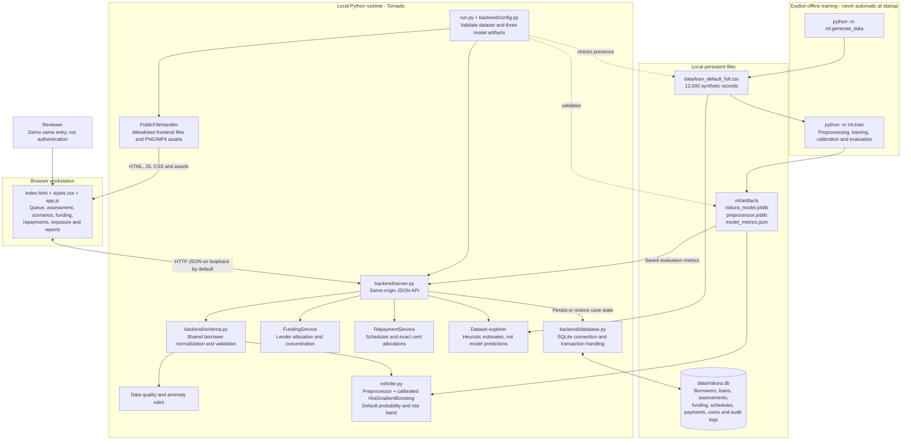
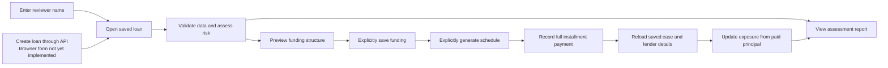

# RISKORA architecture

This diagram describes the current local prototype. Mermaid diagrams render directly on GitHub. Source references are relative to the repository root.

## Application and data flow

Reports are assembled in the browser from the active case and restored API data. They are not separately persisted report documents. Borrower default risk and lender concentration are distinct outputs. Explanation points are policy rules, not SHAP values or model-specific attributions.

## Current reviewer workflow

Changing funding controls creates a preview, not a saved commitment. Schedule controls require an explicit generate action. Recording a payment requires an existing schedule and the exact positive installment amount. Duplicate paid installments are rejected; loans with recorded payments cannot be reconfigured. Lender exposure subtracts paid principal allocations, including waterfall allocations.

These actions are local database operations: no money is transferred, and no external lender or payment provider is connected. Human approval stages are not yet enforced by a complete backend state machine.

## Boundaries and verification

- Startup validates the model, preprocessor and metrics before database initialization. Training is an explicit separate operation.
- Static serving excludes source, database, dataset and artifact files. API access is still unauthenticated; the reviewer label does not establish a trusted identity.
- `tests/support.py` isolates database-writing tests in temporary databases. `.github/workflows/tests.yml` runs startup checks and regressions on Windows and Linux.
- Partial payments, authenticated roles, reviewer-linked decision auditing, controlled approval transitions, schedule migrations and production operations remain future work.

See [README](README.md) for setup, [API documentation](API_DOCUMENTATION.md) for routes, and [testing notes](TESTING.md) for verification details.
