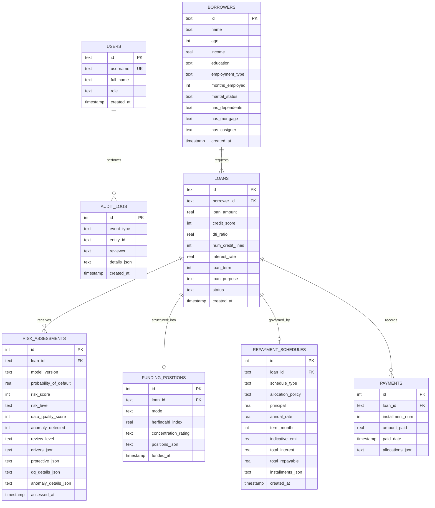

# RISKORA — Database Schema & Relational Architecture
**SQLite Relational Persistence Layer**

---

## 1. Entity-Relationship Diagram



---

## 2. Table Specifications & DDL

### `users`
Underwriters and credit analysts with access to the workstation.
```sql
CREATE TABLE users (
    id TEXT PRIMARY KEY,
    username TEXT UNIQUE NOT NULL,
    full_name TEXT NOT NULL,
    role TEXT NOT NULL DEFAULT 'RISK_UNDERWRITER',
    created_at TIMESTAMP DEFAULT CURRENT_TIMESTAMP
);
```

### `borrowers`
Borrower profiles and demographic attributes.
```sql
CREATE TABLE borrowers (
    id TEXT PRIMARY KEY,
    name TEXT NOT NULL,
    age INTEGER,
    income REAL NOT NULL,
    education TEXT,
    employment_type TEXT,
    months_employed INTEGER,
    marital_status TEXT,
    has_dependents TEXT DEFAULT 'No',
    has_mortgage TEXT DEFAULT 'No',
    has_cosigner TEXT DEFAULT 'No',
    created_at TIMESTAMP DEFAULT CURRENT_TIMESTAMP
);
```

### `loans`
Active and historical loan requests.
```sql
CREATE TABLE loans (
    id TEXT PRIMARY KEY,
    borrower_id TEXT NOT NULL,
    loan_amount REAL NOT NULL,
    credit_score INTEGER,
    dti_ratio REAL,
    num_credit_lines INTEGER,
    interest_rate REAL,
    loan_term INTEGER,
    loan_purpose TEXT,
    status TEXT DEFAULT 'REQUEST_RECEIVED',
    created_at TIMESTAMP DEFAULT CURRENT_TIMESTAMP,
    FOREIGN KEY (borrower_id) REFERENCES borrowers(id) ON DELETE CASCADE
);
```

### `risk_assessments`
Auditable record of every ML inference execution, explainability attributions, and data quality check.
```sql
CREATE TABLE risk_assessments (
    id INTEGER PRIMARY KEY AUTOINCREMENT,
    loan_id TEXT NOT NULL,
    model_version TEXT NOT NULL,
    probability_of_default REAL NOT NULL,
    risk_score INTEGER NOT NULL,
    risk_level TEXT NOT NULL,
    data_quality_score INTEGER NOT NULL,
    anomaly_detected INTEGER NOT NULL DEFAULT 0,
    review_level TEXT NOT NULL,
    drivers_json TEXT,
    protective_json TEXT,
    dq_details_json TEXT,
    anomaly_details_json TEXT,
    assessed_at TIMESTAMP DEFAULT CURRENT_TIMESTAMP,
    FOREIGN KEY (loan_id) REFERENCES loans(id) ON DELETE CASCADE
);
```

### `funding_positions`
Syndicated funding commitments, participating lenders, and concentration ratings.
```sql
CREATE TABLE funding_positions (
    id INTEGER PRIMARY KEY AUTOINCREMENT,
    loan_id TEXT NOT NULL,
    mode TEXT NOT NULL,
    herfindahl_index REAL,
    concentration_rating TEXT,
    positions_json TEXT NOT NULL,
    funded_at TIMESTAMP DEFAULT CURRENT_TIMESTAMP,
    FOREIGN KEY (loan_id) REFERENCES loans(id) ON DELETE CASCADE
);
```

### `repayment_schedules`
Generated amortisation schedules, frequency configurations, and waterfall policies.
```sql
CREATE TABLE repayment_schedules (
    id INTEGER PRIMARY KEY AUTOINCREMENT,
    loan_id TEXT NOT NULL,
    schedule_type TEXT NOT NULL,
    allocation_policy TEXT NOT NULL,
    principal REAL NOT NULL,
    annual_rate REAL NOT NULL,
    term_months INTEGER NOT NULL,
    indicative_emi REAL NOT NULL,
    total_interest REAL NOT NULL,
    total_repayable REAL NOT NULL,
    installments_json TEXT NOT NULL,
    created_at TIMESTAMP DEFAULT CURRENT_TIMESTAMP,
    FOREIGN KEY (loan_id) REFERENCES loans(id) ON DELETE CASCADE
);
```

### `payments`
Recorded cash inflow events with installment reconciliation.
```sql
CREATE TABLE payments (
    id INTEGER PRIMARY KEY AUTOINCREMENT,
    loan_id TEXT NOT NULL,
    installment_num INTEGER NOT NULL,
    amount_paid REAL NOT NULL,
    paid_date TIMESTAMP DEFAULT CURRENT_TIMESTAMP,
    allocations_json TEXT NOT NULL,
    FOREIGN KEY (loan_id) REFERENCES loans(id) ON DELETE CASCADE
);
```

### `audit_logs`
Chronological event logging for institutional accountability.
```sql
CREATE TABLE audit_logs (
    id INTEGER PRIMARY KEY AUTOINCREMENT,
    event_type TEXT NOT NULL,
    entity_id TEXT,
    reviewer TEXT,
    details_json TEXT,
    created_at TIMESTAMP DEFAULT CURRENT_TIMESTAMP
);
```
