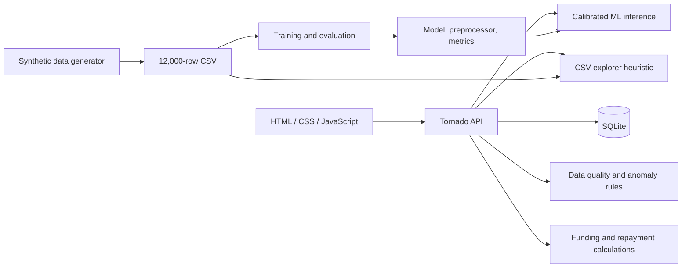

RISKORA project analysis — 24 September 2026
==========================================

RISKORA is a substantial academic prototype with real trained ML inference, a connected lending-review interface, and persistent SQLite records. Its current implementation is not ready for operational lending: authentication, data normalization, payment integrity, exposure accounting, and frontend state restoration have significant defects.

This review covers all 53 existing project files outside `.git`, including all source files, documentation, both datasets, the database, model artifacts, branding assets, and nine Python cache files. Git metadata was inventoried and its object integrity checked. The initial checkout was clean at commit `7e7bc23` (`Initial`). This report is the only added project file; no application code, model, dataset, or project database was changed.

Verification used an isolated temporary copy. The existing 22 tests passed in 6.102 seconds. Additional targeted probes reproduced defects below. Python source parsing and `node --check app.js` passed. Full browser interaction, screen-reader testing, video playback/audio, production load testing, and model retraining were not performed. Visual review covered the branding board; all five PNGs passed image-file verification and the video container metadata was inspected. Binary caches and Git objects were inspected as generated artifacts, not as independent application source.

**What the project actually implements**

| Layer | Implementation | Important boundary |
|---|---|---|
| Interface | HTML, CSS, plain JavaScript; ten views in one page | No frontend framework or build step |
| API | Tornado; 12 route patterns and 13 GET/POST operations | Handlers execute synchronous database, pandas, and ML work |
| Storage | SQLite; eight application tables | Several financial structures are JSON blobs rather than separate ledger tables |
| Prediction | Five calibrated HistGradientBoosting estimators | Real supervised ML; trained on generated data |
| Explanations | Fixed threshold rules and fixed point values | Not SHAP, tree-path attribution, or a decomposition of the predicted score |
| Data quality | Completeness, range, and contradiction checks | Checks input values; does not verify supporting documents |
| Anomalies | Handwritten rules and additive severity scores | No fitted statistical anomaly model |
| Funding | Fixed lender names, prescribed weights, HHI | Allocation calculator; no lender capacity constraints, commitments, or money movement |
| Repayment | Amortisation and three allocation policies | Planned schedules plus manual payment flags; incomplete accounting controls |
| Automation | Browser demo timer | No LLM, autonomous agent, tool orchestration, or learning feedback loop |

Startup follows `run.py` → optional data generation → optional training → `backend.server.run_server()`. Importing `backend.database` already initializes and seeds the database. Startup repeats those checks, loads the model, and binds an available port between the requested port and the next nine ports. The browser loads the default case and queue even before the reviewer enters their name.

**Highest-priority findings**

P1 below means a major correctness or security issue to resolve before using the affected workflow. P2 means an important reliability, presentation, or maintainability issue. These priorities describe this implementation, not a regulatory assessment.

| Priority | Finding and evidence | Consequence | Recommended correction |
|---|---|---|---|
| P1 | `backend/server.py:753` serves the entire repository through the fallback static handler. Isolated requests for `/data/riskora.db`, `/backend/server.py`, and `/ml/artifacts/riskora_model.joblib` all returned HTTP 200. | Anyone who can reach the server can download the database, source, and artifacts. `.git` is also inside the configured static root, although its download was not probed. | Serve a dedicated public directory or explicit frontend assets only. |
| P1 | `backend/server.py:70` accepts a name and returns a role without credentials or a session token. No handler enforces an authenticated identity. `/api/loans` returned 200 without login. | The entry screen does not protect reads or mutations. Wildcard CORS further broadens browser access to reachable endpoints. | Implement authenticated sessions, authorization, and controlled origins. For local demos, bind explicitly to loopback. |
| P1 | `ml/infer.py:46`, `data_quality.py`, and `anomaly_detector.py` omit database snake_case aliases. Saved `credit_score`, `dti_ratio`, `employment_type`, etc. are ignored. | ID-only analysis and scenario baselines silently use defaults. The normal UI supplies many canonical overrides but omits saved marital status and loan purpose. | Normalize once at the API boundary into a single validated schema used by every engine. |
| P1 | `backend/server.py:534` marks a payment PAID before checking its amount or previous status. A payment of -1 returned 200 and PAID; repeating it also returned 200. | Negative, partial, duplicate, and out-of-order payments can corrupt payment history and settlement status. Omitted or zero amounts are replaced with the scheduled amount. | Add positive amount validation, partial-payment handling, idempotency, schedule/installment identity, and transactional allocation based on actual cash received. |
| P1 | `backend/server.py:155` embeds `Bachelor's` in SQL using Python backslash escaping, which does not escape the apostrophe for SQL. | A basic `POST /api/loans` returned 500: `near "s": syntax error`. Loan creation is broken. | Parameterize education along with every other inserted value. |
| P1 | `LoanDetailHandler` returns stored funding and repayment rows without restoring the full calculation response. | Reopening a case, including immediately after recording a payment, loses UI-required fields and produces missing/incorrect values. | Use shared response serializers for create and read operations; persist or reconstruct all required fields. |
| P1 | `app.js:759` takes the first unpaid installment's *post-payment* balance as current outstanding principal. | Exposure is reduced before that installment is paid. Lender exposure always uses original shares even for waterfall repayments. | Compute outstanding from original capital minus actual principal allocations already paid. |
| P1 | `backend/server.py:110` joins every assessment; portfolio aggregation at `:593` also counts all assessments. | Repeat analysis duplicates loans and inflates risk counts. The isolated queue returned 29 rows for six unique loans after test/probe activity. High-risk percentages can exceed 100%. | Select one latest assessment per loan with a deterministic ID tie-breaker. |
| P1 | `ml/infer.py:105` assigns fixed explanation points, while `ml/train.py:213` exports LogisticRegression coefficients as global importance for the deployed HistGBM workflow. | Users are shown explanations that are not derived from the prediction they are reviewing. | Label existing outputs as independent policy rules and baseline coefficients, or implement model-specific explanations. |
| P1 | `app.js:258` changes HIGH-risk recommendations to Conditional Approval whenever fractional funding exists. Its report then describes this branch as PD 8–20%, even for HIGH-risk cases. | The report can contradict the actual PD and model recommendation. Data quality and anomaly results do not gate the recommendation. | Centralize the decision policy and preserve risk band, verification requirements, and human decision state independently of syndication. |
| P2 | `backend/server.py:129` evaluates `None < 70` on unassessed loans and reverses the intended incomplete-record selection. | The Requires verification filter returned 500. If the null error is fixed alone, the filter will still omit the incomplete rows. | Handle null explicitly and include, rather than skip, records requiring verification. |
| P2 | `backend/services/data_quality.py:153` divides by zero for zero income; `:130` reparses invalid age after recording a warning. | Invalid inputs raise exceptions instead of returning usable validation errors. Both failures were reproduced. | Validate types and finite ranges once and stop unsafe calculations. Include validity warnings in `verification_ready`. |
| P2 | `repayment_service.py:162` rounds each lender's allocation independently without distributing a residual. | 15 of 36 installments in a tested three-lender schedule did not exactly reconcile. Example: payment 4014.44, allocations 4014.45. | Use integer minor units or Decimal and allocate the final residual deterministically. Test exact per-installment and per-lender totals. |
| P2 | `app.js:157` does not call `renderDecision()` when navigating to the decision page. Its only invocation is in the automated demo. | Manual navigation can show a blank report; later navigation can show a stale report. | Render the report on entry and invalidate it when the active case or calculations change. |
| P2 | Funding/repayment form changes immediately persist new rows; generation can occur after payments; analysis and funding overwrite loan status without transition checks. | Historic schedules can become detached from payments and a paid/repaying loan can regress to an earlier workflow status. | Separate previews from commits, version schedules, and enforce a loan state machine. |
| P2 | Latest records are selected by second-resolution timestamps without an ID tie-breaker. | Multiple writes within one second may return an older assessment, funding structure, or schedule. | Order by timestamp and primary key descending, or store explicit current-version references. |
| P2 | Dataset search uses pandas regex matching on user input. Searching `[` returned 500. | Ordinary search punctuation breaks the endpoint; unbounded regex input is unnecessary. | Use literal search (`regex=False`) and validate pagination inputs. |
| P2 | `backend/database.py:15` creates connections used with a transaction context manager, without explicit closure. | The test run reported unclosed SQLite connection warnings. Synchronous handlers also block the event loop. | Explicitly close connections and separate blocking inference/data work from request handling as needed. |
| P2 | Dependencies are not declared or locked. Tornado was missing from the default Python environment, and artifacts reported sklearn 1.9.1 while the installed version was 1.9.0. | A clean machine cannot reliably reproduce startup or training. Artifact loading currently emits compatibility warnings. | Add a supported Python/dependency specification, lock versions, and record artifact hashes and environment metadata. |

**Reproduced input-normalization failure**

For saved case `LR-1054`, the database has credit score 548, DTI 0.52, eight employment months, and Contract employment. Passing that database dictionary directly into inference normalized these to 650, 0.32, 36, and Salaried.

| Experiment | Result |
|---|---|
| ID-only risk analysis | PD 12.42%, MEDIUM |
| Same saved profile with every database alias correctly mapped | PD 57.17%, HIGH |
| Scenario containing the case's unchanged loan amount, credit score, and DTI | Baseline 12.42%; scenario 34.69%; reported increase 22.27 percentage points |

These numbers were measured with the installed sklearn 1.9.0 environment loading the supplied 1.9.1 artifacts. They demonstrate the mapping failure; they should not replace expected production predictions or the documented demo values without fixing and revalidating the environment and input contract.

**File-by-file review: project root**

| File | Role | Assessment |
|---|---|---|
| `run.py` | 43-line launcher; creates missing full dataset, trains if the model file is absent, starts server | Simple entry point. Checks only the model file, although inference also requires the preprocessor and metrics JSON. Does not validate artifact compatibility or dataset/model correspondence. Invalid port strings silently fall back; no dependency bootstrap. |
| `index.html` | 789-line ten-view workstation, access gate, video intro, forms, tables, report container | Covers the whole demo flow without external JS dependencies. Initial online/ledger labels and some validation figures are hardcoded. `appShell` starts with `aria-hidden="true"` and is never unhidden for assistive technology. No CSV file picker or persistent new-loan form exists despite older documentation. |
| `app.js` | 1,176-line state management, REST calls, rendering, workflow actions, demo timer | Centralized API helper and text escaping are useful. Global mutable state, inconsistent response schemas, stale reports, no request cancellation, and missing form synchronization cause cross-view errors. Financial values are rounded to whole rupees for display. |
| `styles.css` | 80 physical lines, much of the stylesheet compressed into the first line; layouts, branding, responsive rules, print rules, toasts | Consistent visual vocabulary and focus rings. Mobile rules hide all sidebar navigation without replacement. Inline intelligence-grid columns override responsive CSS. Case table renders seven cells but base CSS defines six columns. Much text is 8–11px. These are static findings, not browser-measured layout results. |
| `architecture.svg` | 1400×820 vector architecture diagram | Describes the older deterministic browser prototype and a future ML layer. Contradicts the current Python/ML implementation and newer architecture document. Valid XML/vector source; not a live architectural source of truth. |
| `README.md` | Main project introduction, quick start, feature claims, documentation index | Good entry point but overstates maturity, historical data, exact attribution and penny reconciliation. Test count is outdated (21 instead of 22); startup folder name is stale. Dependency installation instructions are missing. |
| `ARCHITECTURE.md` | Nine Mermaid diagrams for components, inference, data ingestion, funding, repayment, deployment, roadmap | Broadly identifies current modules. SHAP/tree attribution, CSV upload, SQLite connection pooling, and some repayment guarantees are not implemented as drawn. Raw schema counts are inconsistent: 18 CSV columns include ID and target, leaving 16 raw model attributes. |
| `API_DOCUMENTATION.md` | Endpoint examples and JSON request/response descriptions | Useful outline but calls name registration authentication. Omits `POST /api/loans` and portfolio exposure from the detailed endpoint specification. Examples differ from current funding weights, EMI, prediction values, and response restoration behavior. No formal validation/error/auth contract. |
| `DATABASE_SCHEMA.md` | Eight-table DDL and ER diagram | DDL generally matches code. ER diagram implies users→audit foreign keys and one-to-one loan→funding/schedule cardinalities that are not enforced. Payments have no schedule FK or duplicate-event constraint. |
| `DATA_DICTIONARY.md` | Raw schema and derived feature descriptions | Helpful field glossary. Actual default values differ: missing employment months become 36, not 0; missing credit score becomes 650, not a +15 thin-file penalty. Missing Age is not included in completeness scoring. Calls 18 CSV fields features although ID/target are excluded. |
| `ML_PIPELINE.md` | Training splits, algorithms, metrics, calibration, scoring, explanations | Splits and stored test metrics are reproducible. Data is synthetic, not historical. Gradient attribution, optimized loss policy, and runtime performance assertions are not established by this code. Score mapping is piecewise linear and clipped to 5–99, not a full 0–100 logistic scale. |
| `MODEL_CARD.md` | Intended use, metrics, fairness and limitations | A useful structure, but dataset provenance must explicitly say synthetic. Includes no measured subgroup fairness results. Claims about thin-file routing and normalized credit cycles are unsupported by implementation. Credit-history duration is not an input. |
| `TESTING.md` | Test commands, coverage matrix, claimed verification log | Actual suite has 12 domain/database tests plus 10 API tests. Document claims 21, lists a metrics test that is absent, and omits current payment tests. Passing tests do not fully validate API contracts or accounting. |
| `DEMO_GUIDE.md` | Fifteen-minute presentation script | Useful narrative but overclaims secure sessions, exact ML attribution, real-time lender balances, and historical data. Hardcoded predictions, allocations, EMI, and one LTI driver do not match current implementation. Local path belongs to another machine. |
| `FACULTY_QA.md` | Nineteen academic defense answers | Several useful concepts, especially separating PD from concentration. Claims of contrastive tree explanations, active PSI/rolling-Brier monitoring, real observed outcomes, guaranteed calibration, and automatic missing-data routing exceed the code. Distinguish implemented behavior from future design. |
| `ALGORITHM_V1_SPEC.md` | Older deterministic scoring rules and score bands | Historical design reference; not the live prediction implementation. Mark as archived baseline and document whether it is still used for comparison. |
| `FEATURES.txt` | Older browser-only workflow and limitations | Contradicts current persistence and ML implementation. Describes removed browser CSV upload and local scoring. Some claimed resets and state protections are also absent. |
| `NEED_TO_ADD.txt` | One-line backlog: login, database, AI | Stale: database and ML exist; actual authentication remains missing. Replace with a verified backlog. |
| `V1_ROADMAP.md` | Original deterministic-to-ML roadmap | Describes ML as future work although it is already present. Needs version separation from current release. |
| `REVIEW1_DATASET_WORKFLOW.md` | Original static HTTP server/CSV demo steps | `python -m http.server` cannot serve the current API workflow. File upload steps no longer match the UI. Archive or rewrite. |

Additional frontend findings: switching to an unassessed case sets `activeAnalysis = null` but does not clear the old intelligence DOM; similarly, repayment rendering returns early on null without clearing an earlier schedule. Scenario sliders and searches dispatch on every input without debouncing or guarding against stale responses. `openCaseById()` sets principal and sliders but not repayment rate/term/date/policy from the loaded loan. The UI treats 0% interest as the 12.5% fallback because it uses `||`. `applyFunding()` and the timed demo may continue after an earlier action fails because those action functions catch errors without rejecting. The demo can overlap actions on slow requests. Reset case reloads a fixed case; it does not reset persisted state.

**File-by-file review: backend and services**

| File | Role | Assessment |
|---|---|---|
| `backend/server.py` | 824-line API, static delivery, server startup | All handlers are in one module. Uses parameterized SQL in most queries, but has the confirmed create-loan SQL bug. Missing shared input validation, authentication, response schemas, lifecycle checks, idempotency, and actual health probes. Error responses expose raw exception details. |
| `backend/database.py` | 231-line schema, connection factory, seed fixtures | Foreign keys are enabled per connection and the supplied database passes integrity checks. `CREATE TABLE IF NOT EXISTS` is not a migration system. Import side effects write to storage. Uses REAL amounts, no financial CHECK constraints, no explicit connection close, no useful secondary indexes on loan/time lookups. |
| `backend/services/data_quality.py` | 186-line quality engine for eight required and seven optional fields | Keeps quality separate from predicted risk, which is a good design choice. Aliases differ from DB schema; invalid inputs can crash. Score has a 20-point base and 10 floor. `verification_ready` ignores range-validity warnings, and completeness means field presence rather than verified evidence. |
| `backend/services/anomaly_detector.py` | 127-line rule-based irregularity detector | Clear indicator types and cautious decision-support language. Fixed thresholds and additive weights, not trained distributions. Zero values can disappear through `or` chains. Does not share normalization with inference/DQ; median constants are unused. |
| `backend/services/funding_service.py` | 118-line single/fractional allocation and HHI | Correctly distinguishes concentration from borrower PD and reconciles funding shares/capital residuals. Names are fixed, lender count is clamped to 2–6, invalid non-single modes behave as fractional. Negative/zero custom weights and amounts lack validation. No actual lender constraints or optimization objective. |
| `backend/services/repayment_service.py` | 271-line annuity schedules, pro-rata/largest-first/FIFO allocations | Final loan-level principal balance is absorbed to zero; ordinary schedules pass existing tests. Per-lender rounded allocations do not always reconcile. FIFO uses list order, not funding timestamps. Largest-first can pay past balance parity rather than redistributing at parity as described. `custom` is the monthly path, not custom scheduling. |

Repayment also accepts inconsistent lender commitments and schedule principal. Negative amounts/rates and unreasonable terms are not rejected coherently. Terms below one are silently converted to one. Bi-monthly dates use the 5th/20th of the selected month and can precede the entered first due date. Flexible windows begin on the chosen day, not necessarily the advertised 1st–7th. Regenerating a schedule does not reconcile prior payments into it.

The API stores risk outputs without an immutable input snapshot or artifact hash. Audit entries use fixed reviewer strings instead of the submitted reviewer identity; not all mutations are logged. Login IDs use a process-dependent hash reduced to only 10,000 values, creating collision risk and possible returned-ID mismatch after an upsert. New loan IDs use short timestamp fragments and can collide. These issues limit auditability even though audit records exist.

**File-by-file review: data**

| File | Verified contents | Assessment |
|---|---|---|
| `data/loan_default_full.csv` | 1,171,685 bytes; 12,000 rows; 18 columns; 12,000 unique IDs; no empty cells; 1,330 defaults | Exactly equals `generate_benchmark_dataset(12000, seed=42)` in a cell-by-cell dataframe comparison. It is a generated benchmark, not an imported historical portfolio. |
| `data/sample_loan_default.csv` | 1,082 bytes; 15 rows; 14 columns; 15 unique IDs; no empty cells; six defaults | Legacy miniature dataset. Missing Education, EmploymentType, MaritalStatus, and LoanPurpose. Can support the explorer fallback, but cannot be substituted directly into the current training pipeline without adapting the schema. |
| `data/riskora.db` | 356,352-byte SQLite database; integrity check `ok`; no foreign-key violations | Contains accumulated demo/application activity, not just clean seed fixtures. It is tracked in Git and exposed by the static route. Tests normally write into this same path. |
| `data/README.txt` | Older CSV input/schema notes and source reference | Describes browser upload and a separate 255,347-row source dataset. Those are not the current bundled data/workflow. External provenance/reference claims were not independently verified; the actual bundled dataset was verified against the generator. |

Original database snapshot, read without mutation:

| Application table | Rows | Interpretation |
|---|---:|---|
| users | 2 | Reviewer identities, no credentials |
| borrowers | 6 | Curated borrower profiles |
| loans | 6 | Curated loan requests |
| risk_assessments | 22 | Repeated analyses across loans |
| funding_positions | 12 | Funding structure history, JSON positions |
| repayment_schedules | 19 | Generated schedule history, JSON installments |
| payments | 9 | Recorded payment events |
| audit_logs | 30 | Selected operation logs |

SQLite also contains its internal `sqlite_sequence` table with five rows. Database integrity passing establishes storage consistency, not correctness of financial events or workflow state.

**File-by-file review: ML**

| File | Role | Assessment |
|---|---|---|
| `ml/generate_data.py` | 144-line seeded generator with demographic/financial distributions and a logistic default sampling rule | Reproducible synthetic data supports demonstrations and pipeline checks. Its assumptions generate the outcome labels; evaluation on this distribution does not establish real-world lending performance. Calls `np.random.seed`, affecting global random state. |
| `ml/train.py` | 292-line split/preprocess/benchmark/calibrate/evaluate/export workflow | Correctly excludes `Default` and LoanID, splits before fitting the held-out-test preprocessor, and exports real models. Champion name is hardcoded. No pinned environment, subgroup evaluation, drift computation, confidence intervals, or artifact registry. Global importance comes from the baseline LR model. |
| `ml/infer.py` | 345-line singleton loader, normalization, prediction, score banding, explanatory rules | Real model inference confirmed. Missing input aliases and generous fallback values are the main correctness issue. Explanations use constants; the supplied `pd_score` and loaded reference means/stds are not used to derive them. Model/artifact version checks are absent. |
| `ml/artifacts/riskora_model.joblib` | 2,594,452 bytes; `CalibratedClassifierCV`, five calibrated folds | Successfully loads and reproduces recorded test metrics in this audit environment, with sklearn version warnings. Must be treated as a trusted executable serialization artifact; do not accept arbitrary replacements. |
| `ml/artifacts/preprocessor.joblib` | 5,095 bytes; ColumnTransformer; 18 engineered-input columns to 26 encoded features | Required alongside the model. Eleven numeric and seven categorical inputs; the 18 model inputs are 16 raw predictor attributes plus two derived ratios. No imputer pipeline; defaults are handled separately in inference. |
| `ml/artifacts/model_metrics.json` | 12,319 bytes; 660 lines; metadata, benchmark comparisons, curves, importance, reference statistics, thresholds | Stored training date is 2026-09-16. The reported performance is real for the supplied artifact and synthetic split. No dataset hash, dependency lock, reliability curve, subgroup metrics, or measured drift data. |

Held-out evaluation was independently recomputed using the supplied artifacts and the source's exact stratified split. No retraining was needed.

| Metric | Stored | Recomputed |
|---|---:|---:|
| Test rows | 1,800 | 1,800 |
| ROC-AUC | 0.7919 | 0.7919 |
| Average precision, labelled PR-AUC | 0.4023 | 0.4023 |
| Brier score | 0.0821 | 0.0821 |
| TN / FP / FN / TP at PD 0.20 | 1460 / 141 / 119 / 80 | 1460 / 141 / 119 / 80 |

At this threshold 80 of 199 defaults are captured and 119 are missed. Calibration is a fitted procedure, not a guarantee that an individual PD is the true default likelihood. The constant-prevalence Brier reference on this test set is approximately 0.0983; the stored model improves on that, but this does not prove deployment calibration. The test data is held out from model fitting, but drawn from the same synthetic generator.

Additional methodology observations: preprocessing is fitted once before calibration's internal CV, so internal held-out folds influence preprocessing statistics even though the final validation/test sets remain separate. Putting preprocessing inside the estimator pipeline would make fold isolation cleaner. The 0.08/0.20 thresholds are fixed; there is no implemented cost-optimization search. LogisticRegression and RandomForest use balanced class weights while HistGBM does not; calibrating all candidates would make probability-quality comparisons more informative. Risk bands are PD-based, while rounding allows scores 30 and 60 at adjacent-band boundaries. The dataset explorer bypasses the trained model entirely and uses a shorter logistic heuristic; its risk labels and estimated PD are not the calibrated model outputs, and its score formula lacks the inference engine's 5–99 clamp.

**File-by-file review: tests and generated Python caches**

| File | Role | Assessment |
|---|---|---|
| `tests/test_riskora.py` | 195 lines; 12 tests for two ML profiles, DQ, anomalies, funding, repayment, seed persistence | Valuable happy-path tests. Allocation comparison uses `places=1`, allowing the observed one-paise discrepancies. No input-alias parity, invalid-input, FIFO, exact reconciliation, or real payment-ledger tests. |
| `tests/test_api_integration.py` | 162 lines; 10 Tornado HTTP tests | Exercises health, queue/detail, scoring, simulation, funding, schedules, explorer and payment recording/fallback. Mostly checks response existence/status. Supplies canonical risk fields, masking the DB alias bug. Uses the normal project database and leaves mutations behind. No create-loan/auth/security/duplicate-payment/response-parity coverage. |
| `backend/__pycache__/database.cpython-312.pyc` | Cached Python 3.12 database bytecode | Generated file tracked in Git; remove from source control and regenerate locally. |
| `backend/__pycache__/server.cpython-312.pyc` | Cached Python 3.12 API bytecode | Same; source `.py` is authoritative. |
| `backend/services/__pycache__/anomaly_detector.cpython-312.pyc` | Cached anomaly service | Same. |
| `backend/services/__pycache__/data_quality.cpython-312.pyc` | Cached quality service | Same. |
| `backend/services/__pycache__/funding_service.cpython-312.pyc` | Cached funding service | Same. |
| `backend/services/__pycache__/repayment_service.cpython-312.pyc` | Cached repayment service | Same. |
| `ml/__pycache__/infer.cpython-312.pyc` | Cached inference service | Same; unrelated to the persisted trained model. |
| `tests/__pycache__/test_api_integration.cpython-312.pyc` | Cached API tests | Same. |
| `tests/__pycache__/test_riskora.cpython-312.pyc` | Cached unit/domain tests | Same. |

There is no test-specific database fixture, browser test suite, CI configuration, coverage configuration, or fresh-install smoke test. Existing successful tests demonstrate selected behavior, not full project correctness.

**File-by-file review: branding assets**

| File | Verified metadata | Usage and assessment |
|---|---|---|
| `assets/riskora-branding-board.png` | 1536×1024 RGBA; 1,512,107 bytes | Brand reference board, visually inspected. Not referenced by current HTML/JS/CSS. |
| `assets/riskora-logo-dark.png` | 840×440 RGBA; 125,502 bytes | Used by the access gate. Image structure verified. |
| `assets/riskora-logo-light.png` | 840×440 RGBA; 125,675 bytes | Alternate logo; not referenced by current frontend. Image structure verified. |
| `assets/riskora-mark-black.png` | 290×280 RGBA; 31,406 bytes | Alternate mark; not referenced by current frontend. Image structure verified. |
| `assets/riskora-mark-white.png` | 290×280 RGBA; 31,481 bytes | Used by the sidebar brand. Image structure verified. |
| `assets/riskora-logo-reveal.mp4` | 2,131,481 bytes; container duration 10.006 seconds | Used by entry animation. Playback/audio not reviewed. The entry flow has playback-error fallbacks but no visible skip control. |

**Git metadata and repository hygiene**

`.git` is version-control infrastructure, not application code. Its files were inventoried; `git fsck --full` completed successfully. The application files, database, model binaries, datasets, and Python caches are all tracked. There is no `.gitignore`, requirements/lock file, `pyproject.toml`, deployment manifest, or standalone license file. The model card's license statement is not a repository-wide license artifact.

| Metadata file or group | Purpose and review |
|---|---|
| `.git/config` | Repository options, origin fetch configuration, and main-branch tracking. No configuration was changed. |
| `.git/description` | Default unnamed-repository description. |
| `.git/HEAD` | Points to `refs/heads/main`. |
| `.git/index` | Git staging index, not a source file. |
| `.git/packed-refs` | Packed reference storage. |
| `.git/info/exclude` | Only template comments; no useful local exclusion rules. |
| `.git/logs/HEAD` | Checkout/reference history. |
| `.git/logs/refs/heads/main` | Local main-branch reference history. |
| `.git/logs/refs/remotes/origin/HEAD` | Remote HEAD reference history. |
| `.git/refs/heads/main` | Current local branch reference. |
| `.git/refs/remotes/origin/HEAD` | Symbolic remote default-branch reference. |
| `.git/refs/codex/turn-diffs/captures/1790234086009/0dc298e2-c994-4c6f-8c1e-24c4d20216e6/base` | Codex diff-capture base reference. |
| `.git/objects/pack/pack-377a51ecc111cf86cb366aa35d734e7e0dccc826.pack` | Compressed repository object store, validated through Git. |
| Same pack basename with `.idx` | Object lookup index. |
| Same pack basename with `.rev` | Reverse object index. |

All 14 hook files have `.sample` names and are inactive templates: `applypatch-msg.sample`, `commit-msg.sample`, `fsmonitor-watchman.sample`, `post-update.sample`, `pre-applypatch.sample`, `pre-commit.sample`, `pre-merge-commit.sample`, `pre-push.sample`, `pre-rebase.sample`, `pre-receive.sample`, `prepare-commit-msg.sample`, `push-to-checkout.sample`, `sendemail-validate.sample`, and `update.sample`. They provide no active validation/CI policy. Pack internals and hook templates were not treated as custom lending logic.

**Verification record and practical next steps**

The default interpreter was Python 3.14. Tornado was absent, so Tornado 6.5.10 was installed into a dependency directory inside the temporary audit copy only. The supplied model/preprocessor were serialized with sklearn 1.9.1; installed sklearn was 1.9.0 and emitted compatibility warnings. Despite that mismatch, all 22 tests and independent held-out metric recomputation succeeded. SQLite connection warnings were also observed. No claim of a fully supported runtime is made from that single successful run.

The isolated copy is at `C:/Users/abdul/AppData/Local/Temp/riskora-audit-eadb71abdeb04aa58102f089c9c09063`. Its `audit_probe.py` contains the additional executable probes. Its database includes test/probe mutations, including deliberately invalid payments; it must not replace the project database. No listening server was left running.

Recommended sequence:

1. Restrict static-file serving and establish real authentication/authorization, or explicitly constrain the application to a local demo mode.
2. Introduce one validated borrower/loan schema and stable response serializers; fix saved-field mapping, loan creation, incomplete filtering, and latest-record selection.
3. Repair payment accounting, idempotency, schedule versions, actual lender balances, exact minor-unit allocation, and workflow transitions.
4. Repair frontend restoration, report rendering, stale-case clearing, mobile navigation, accessibility state, and asynchronous response handling.
5. Accurately label synthetic data, heuristic explanations, and explorer scores; preserve the verified ML metrics with their actual limitations.
6. Pin the runtime and dependencies; isolate test storage; remove generated caches/live demo state from normal source control as appropriate; add regression coverage for the reproduced failures.
7. Consolidate documentation into a current specification and an explicitly archived deterministic baseline.

The most accurate current description is: **an academic micro-lending decision-support prototype with a genuine calibrated ML model, rule-based explanatory guidance, simulated funding allocation, and a partially implemented persistent payment workflow.**
